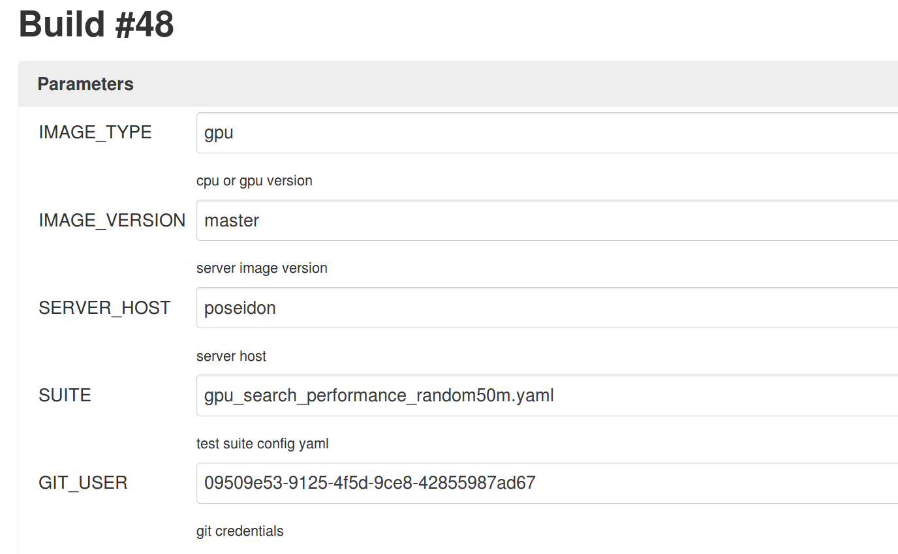
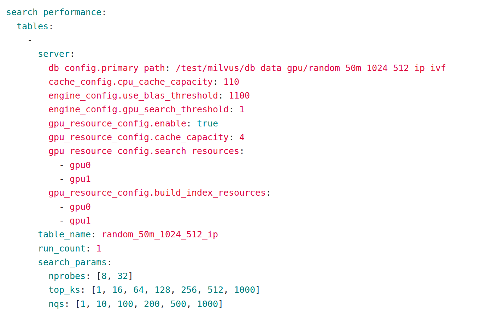

# Quick start

## 运行

### 运行说明：

- 用于进行大数据集的准确性、性能、以及稳定性等相关测试
- 可以运行两种模式：基于K8S+Jenkins的测试模式，以及local模式

### 运行示例：

1. 基于K8S+Jenkins的测试方式：

   

2. 本地测试：

   `python3 main.py --local --host=*.* --port=19530 --suite=suites/gpu_search_performance_random50m.yaml`

### 测试集配置文件：

在进行自定义的测试集或测试参数时，需要编写测试集配置文件。

下面是搜索性能的测试集配置文件：

1. search_performance: 定义测试类型，还包括`build_performance`,`insert_performance`,`accuracy`,`stability`,`search_stability`
2. tables: 定义测试集列表
3. 对于`search_performance`这类测试，每个table下都包含：
   - server: milvus的server_config
   - table_name: 表名，当前框架仅支持单表操作
   - run_count: 搜索运行次数，并取搜索时间的最小值作为指标
   - search_params: 向量搜索参数

## 测试结果：

搜索性能的结果输出：

在K8S测试模式下时，除打印上面的输出外，还会进行数据上报